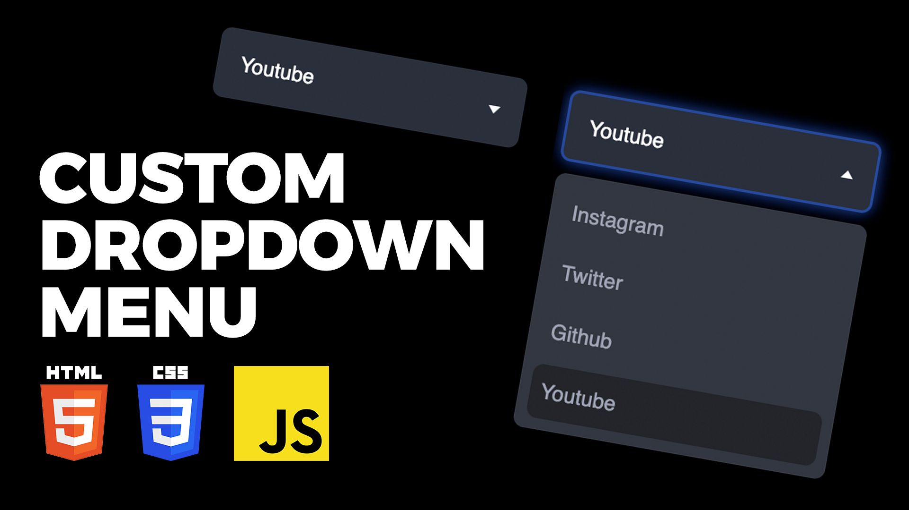

# Advanced Dropdown Menu Using HTML CSS JavaScript | How to Make a Dropdown Menu From Scratch

The Advanced Dropdown Menu, meticulously crafted with HTML, CSS, and JavaScript, presents a sophisticated and interactive navigation solution. This comprehensive tutorial guides users on creating a dropdown menu from scratch, incorporating advanced features for enhanced user experience. Utilizing HTML for structure, CSS for styling, and JavaScript for dynamic behavior, this tutorial empowers developers to implement a customizable and feature-rich dropdown menu that can seamlessly integrate into various web projects. Whether for a navigation bar, user profile menu, or any other application, this step-by-step guide provides the essential knowledge to construct an advanced dropdown menu with ease.

Youtube Tutorial Link: https://youtu.be/3rsvtgUrhgU

